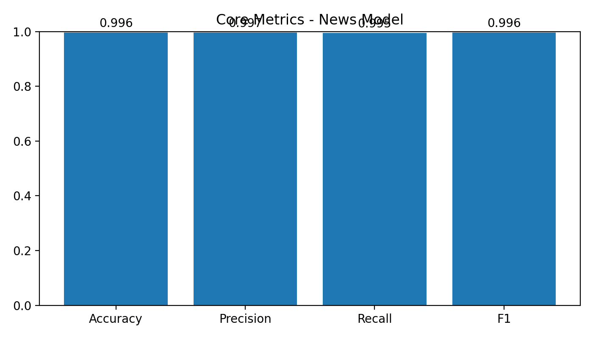
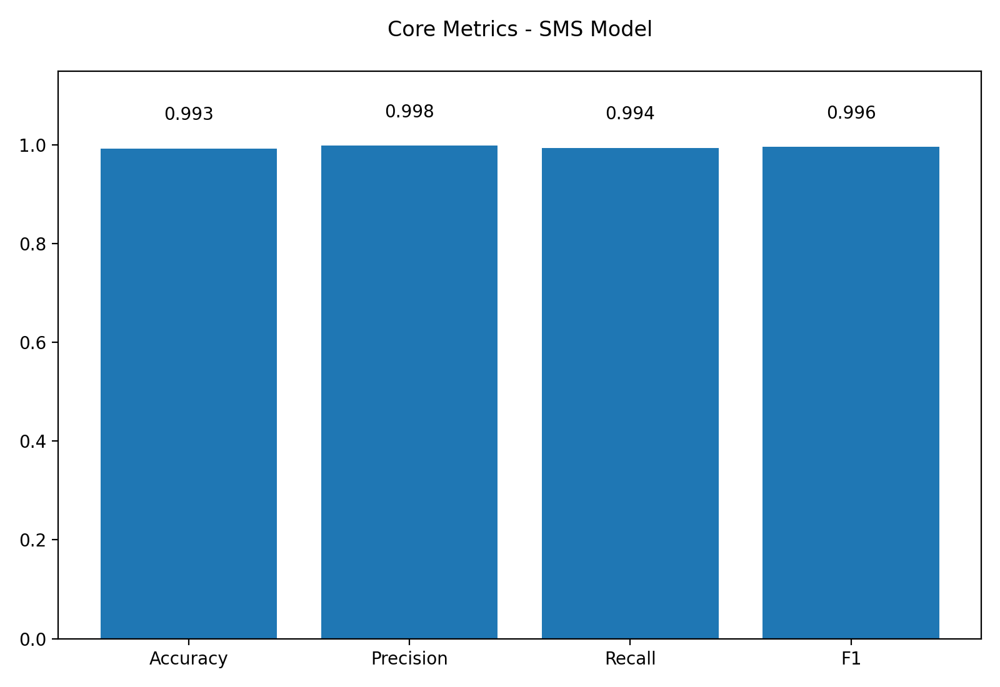
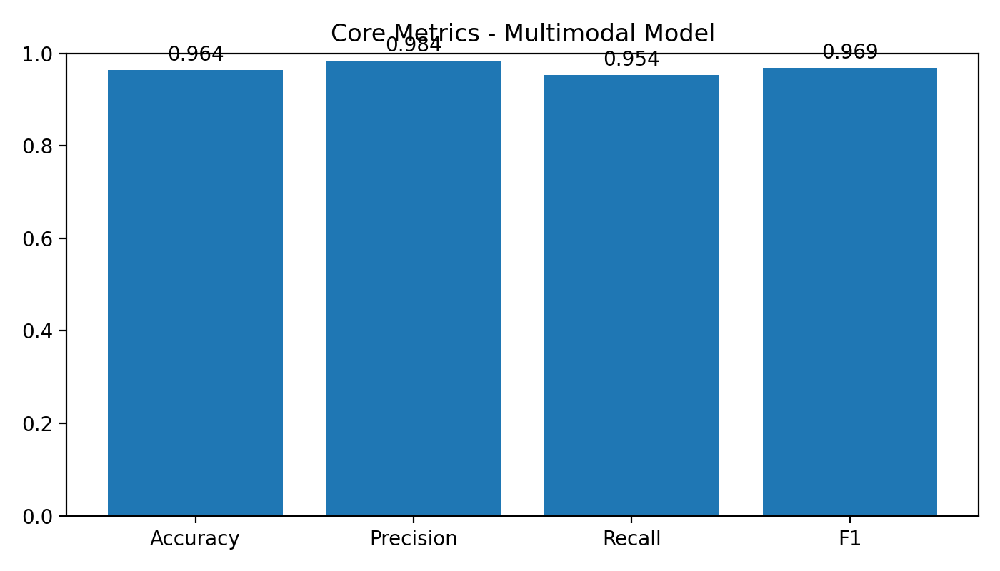

# TruthShield

TruthShield is a research mini project developed for the 4th semester at Chandigarh University.

This project focuses on automated fake information detection using Natural Language Processing and Machine Learning across three data types:
- News text
- SMS/Email text
- Social media text + image pairs

## Project Basics

TruthShield is built as a unified detection framework where different models specialize in different input modalities. Instead of forcing one model to handle every format, each model is trained for its own task and then connected through a shared inference pipeline.

### Objective
- Detect misinformation with higher reliability across varied real-world content formats.
- Reduce false positives using confidence-based decision logic.
- Compare performance across text-only and multimodal settings.

### Task Types
- **News Detection** (binary: Real vs Fake)
- **SMS/Phishing Detection** (binary: Ham vs Spam/Phishing)
- **Multimodal Detection** (binary: Real vs Fake using text + image)

## Model Components

### 1) News Model
- Architecture: RoBERTa-based text classifier
- Input: long-form news content
- Role: captures contextual and semantic cues in article-style text

### 2) SMS/Phishing Model
- Architecture: Hybrid Bi-LSTM + CNN
- Input: short-form messages (SMS/email-like content)
- Role: captures sequential patterns and suspicious token patterns common in phishing/spam

### 3) Multimodal Model
- Architecture: ResNet (image encoder) + BERT (text encoder) + fusion head
- Input: image + associated text
- Role: detects cross-modal inconsistency between visual evidence and caption/context

## Results & Performance

### News Model Performance


### SMS/Phishing Model Performance


### Multimodal Model Performance


For detailed evaluation scripts and additional plots, see the `evaluation/` folder.

## How Everything Is Connected

TruthShield follows a single research pipeline:


**Preprocessing → Training → Evaluation → Unified Inference**

- **Preprocessing:** `preprocessing/preprocess_news.py`, `preprocessing/preprocess_sms.py`, `preprocessing/preprocess_multimodal.py`
- **Training:** `training/train_news_roberta.py`, `training/train_sms.py`, `training/train_multimodal.py`
- **Evaluation:** `evaluation/evaluate_news_model.py`, `evaluation/evaluate_sms_model.py`, `evaluation/evaluate_multimodal_model.py`
- **Unified inference:** `inference/unified_inference.py` routes input to the appropriate model (including text+image for multimodal) and returns the final prediction with confidence

## Repository Areas (Research Flow)

```text
TruthShield/
├── data/                # Raw and processed datasets
├── preprocessing/       # Dataset cleaning and transformation
├── training/            # Model training scripts
├── evaluation/          # Metrics, plots, and reports
├── inference/           # Unified prediction routing logic
└── models/              # Saved model weights/checkpoints
```

## Note on API and Frontend

- For API-specific details, see `README_API.md`.
- For frontend-specific details, see `README_UI.md`.
